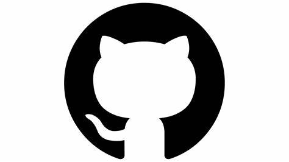

# Desafio GitHub Markdown Isabella

Bem-vindo ao meu repositório **desafio-github-markdown**! Este repositório foi criado para demonstrar meu conhecimento em Markdown, um linguagem de marcação simples e eficiente para formatar texto.

## Descrição

Neste desafio, estou explorando os principais recursos do Markdown, incluindo:

- Títulos e subtítulos
- Ênfase de texto (itálico, negrito)
- Listas ordenadas e não ordenadas
- Links e imagens
- Blocos de código
- Tabelas
- Citações
- Linhas horizontais
- Emojis
- Listas de tarefas

## Índice

1. [Títulos](#títulos)
2. [Ênfase](#ênfase)
3. [Listas](#listas)
4. [Links](#links)
5. [Imagens](#imagens)
6. [Tabelas](#tabelas)
7. [Citações](#citações)
8. [Linhas Horizontais](#linhas-horizontais)
9. [Emojis](#emojis)
10. [Listas de Tarefas](#listas-de-tarefas)
11. [Blocos de Código](#blocos-de-código)


## Títulos

# Título 1
## Título 2
### Título 3
#### Título 4
##### Título 5
###### Título 6

## Ênfase

*Itálico* ou _Itálico_

**Negrito** ou __Negrito__

**_Negrito e Itálico_**

~~Texto Riscado~~

## Listas

### Lista não ordenada

- Item 1
- Item 2
  - Subitem 2.1
  - Subitem 2.2
- Item 3

### Lista ordenada

1. Item 1
2. Item 2
   1. Subitem 2.1
   2. Subitem 2.2
3. Item 3

## Links

[Texto do Link](https://github.com/isabellaf25)

[Link com título](https://github.com/isabellaf25 "Meu github")

## Imagens




## Tabelas

| Coluna 1 | Coluna 2 | Coluna 3 |
|----------|----------|----------|
| Linha 1  | Linha 1  | Linha 1  |
| Linha 2  | Linha 2  | Linha 2  |
| Linha 3  | Linha 3  | Linha 3  |

## Citações

> Esta é uma citação.
> 
> Outra linha da citação.

## Linhas Horizontais

---

## Emojis
⭐,💥 ,🔥,
## Listas de Tarefas
- [ ] tarefa 1 
- [x] tarefa 2

## Blocos de Código

### Código Inline

`código inline`

### Bloco de Código

```javascript
function helloWorld() {
  console.log("Hello, World!");
}

```javascript
function helloWorld() {
  console.log("Hello, World!");
}